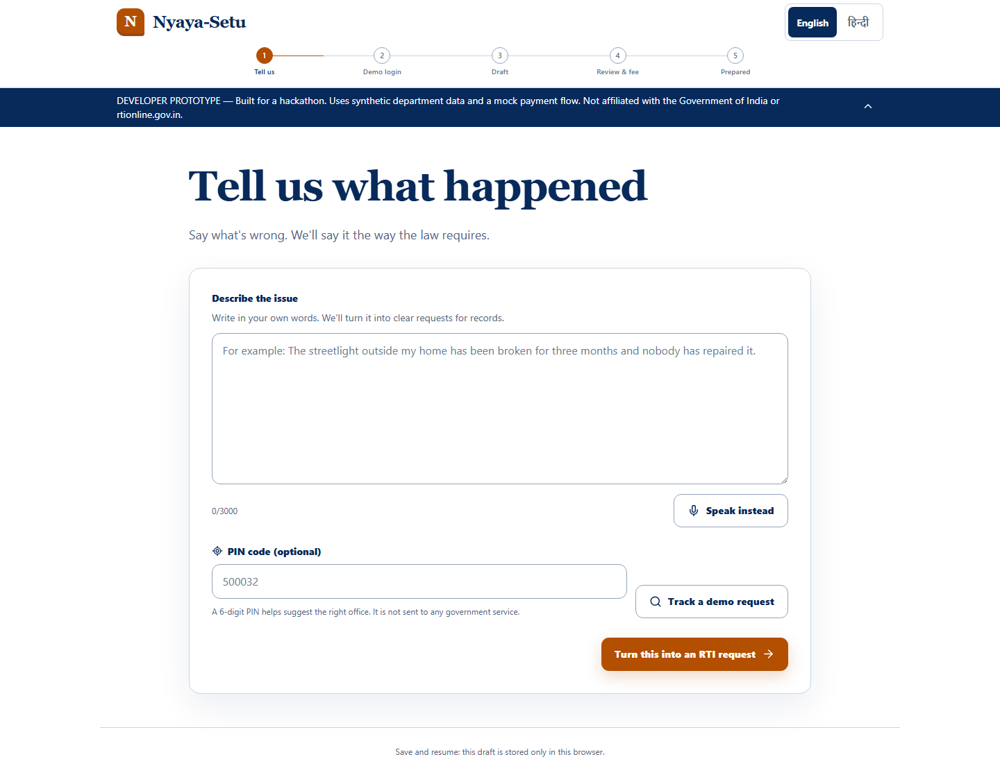
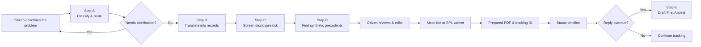
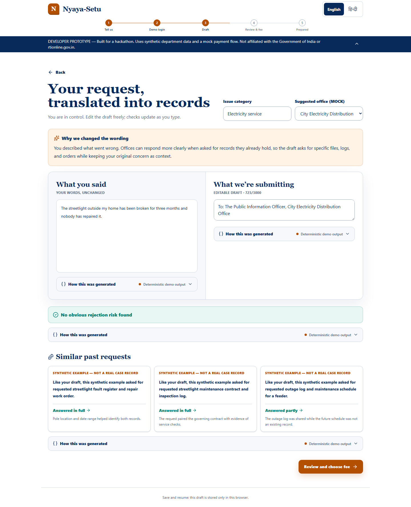
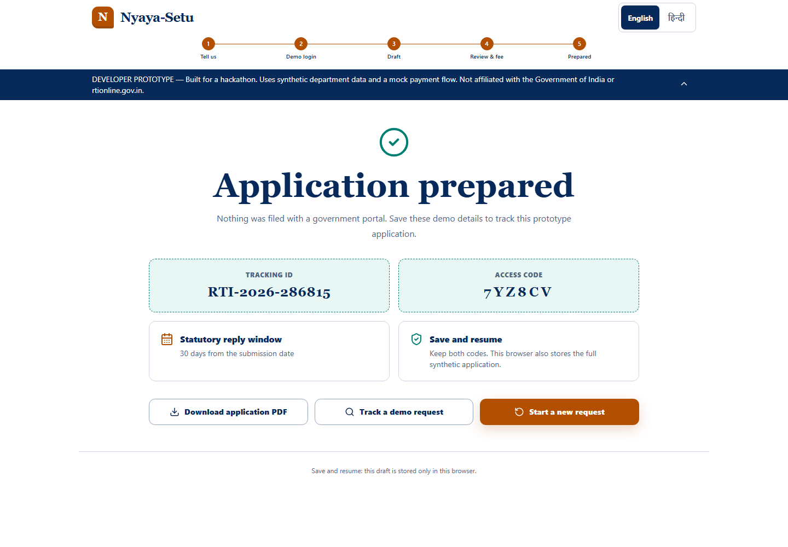
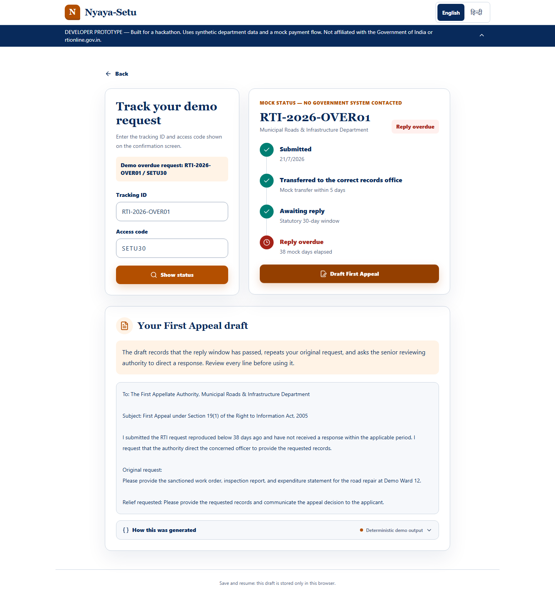
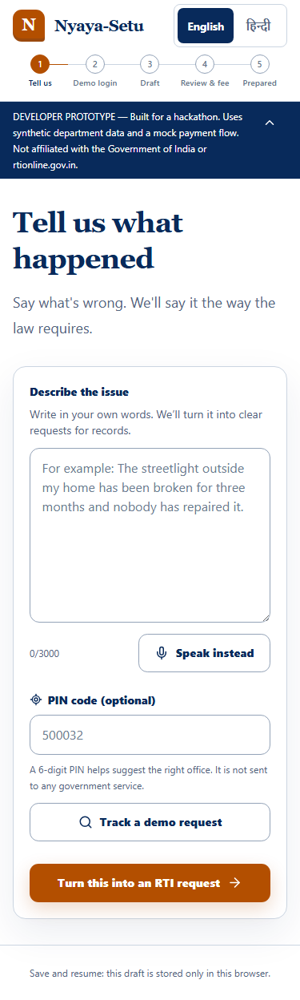

<div align="center">

# Nyaya-Setu

### India’s Intent-to-RTI Intelligence Layer

**From grievance to evidence-ready records requests—without making citizens learn legal drafting first.**

[](https://p-001-flax.vercel.app)
[](https://nextjs.org/)
[](https://www.typescriptlang.org/)
[](#proof-not-promises)
[](#proof-not-promises)

[Try the live application](https://p-001-flax.vercel.app) · [Watch the 90-second demo](#90-second-demo-script) · [Explore the architecture](#system-architecture) · [Run locally](#run-it-locally)

> **Developer prototype:** Uses synthetic department and precedent data, mock OTP/payment/filing flows, and never contacts a government portal. Nyaya-Setu is independent and is not affiliated with the Government of India or rtionline.gov.in.

</div>



---

## The problem

A citizen knows **what went wrong**:

> “The streetlight outside my home has been broken for three months. Why has nobody repaired it?”

But an information-access process needs **identifiable existing records**:

> “Provide the fault-register entry, repair work order, completion entry, and applicable maintenance schedule for the identified streetlight.”

That translation is where many people lose time. They should not need to understand departmental boundaries, records terminology, drafting conventions, exemption risk, or appeal structure before they can ask for information.

**Nyaya-Setu is the bridge between human intent and an inspectable records request.** It preserves the citizen’s original words, proposes a precise editable draft, explains every transformation, and keeps the citizen in control before anything is prepared.

## Why this is a top-1% hackathon build

“Top 1%” is treated here as an **engineering bar, not an unverified award claim**. The evidence is in the scope and execution:

| Top-tier quality | What Nyaya-Setu delivers |
| --- | --- |
| Complete journey | Grievance → mock login → classification → drafting → screening → precedents → fee → PDF → tracking → First Appeal |
| AI with boundaries | Five strict, schema-validated functions instead of an unconstrained chatbot |
| Radical inspectability | Every AI step exposes its exact structured input, output, function name, and execution mode |
| Citizen agency | The original statement stays visible; routing and draft text remain editable |
| Demo resilience | Deterministic fallbacks keep the full experience working without hiding provider failures |
| Trust by design | Synthetic records, mock actions, affiliation limits, and legal limits are disclosed at the point of use |
| Inclusive delivery | English/Hindi UI, browser speech input, 44px controls, responsive layouts, and automated accessibility checks |
| Production discipline | Type-safe routes, versioned persistence, PDF generation, cross-browser E2E tests, zero known dependency vulnerabilities, and a live Vercel deployment |

## What the product does



### Five bounded intelligence contracts

| Step | Function | Input | Structured result |
| --- | --- | --- | --- |
| A | `classify_and_route` | Grievance + optional PIN | Category, suggested synthetic department, confidence, clarification state |
| B | `translate_to_compliant_request` | Grievance + selected office | Editable records request, plain-language explanation, requested-record list |
| C | `screen_exemption_risk` | Current citizen-controlled draft | Risk flags and overall risk level |
| D | `find_similar_precedents` | Draft + category | Three clearly labelled synthetic comparison examples |
| E | `draft_first_appeal` | Original request + office + elapsed days | Editable appeal letter and citizen explanation |

Every contract uses Zod validation and strict JSON Schema with `additionalProperties: false`. If `OPENAI_API_KEY` is available, the server calls the OpenAI Responses API. If the provider is unavailable, the same contract returns a deterministic result explicitly labelled **Deterministic demo output**.

## The flagship experience

### 1. See exactly what changed—and why

The original statement and editable records request sit side by side. Department routing, drafting logic, disclosure screening, and synthetic precedents remain visible rather than disappearing behind a “magic” response.



### 2. Prepare, download, save, and resume

The mock submission flow creates a downloadable PDF, tracking ID, access code, and 30-day status window. The interface states clearly that nothing was filed with a government portal.



### 3. Turn an overdue request into a First Appeal

The seeded reviewer journey demonstrates transfer status, the statutory reply window, overdue state, and a structured Step E appeal—with the same inspectable generation trace.



### 4. Designed for the phone a citizen already has

The complete workflow collapses naturally to 375px without horizontal overflow, undersized controls, or hidden disclosures.

<p align="center">
  
</p>

## System architecture

```mermaid
flowchart TB
    subgraph Client[Citizen experience — Next.js + React]
        UI[Bilingual responsive UI]
        STATE[Typed workflow state machine]
        TRACE[Inspectable AI trace panels]
        PDF[Client-side PDF generation]
        STORE[(Versioned localStorage<br/>drafts + applications + language)]
        UI <--> STATE
        STATE --> TRACE
        STATE --> PDF
        STATE <--> STORE
    end

    subgraph Server[Next.js route handlers]
        A[/api/classify]
        B[/api/translate]
        C[/api/screen]
        D[/api/precedents]
        E[/api/appeal]
        APP[/api/applications]
        ENGINE[Shared structured-output engine<br/>Zod → strict JSON Schema]
        A --> ENGINE
        B --> ENGINE
        C --> ENGINE
        D --> ENGINE
        E --> ENGINE
    end

    subgraph Intelligence[Bounded intelligence layer]
        OPENAI[OpenAI Responses API<br/>optional server-side path]
        FALLBACK[Deterministic demo engine<br/>resilient fallback]
        DATA[(13 synthetic departments<br/>22 synthetic precedents)]
    end

    subgraph Persistence[Prototype persistence]
        JSON[(JSON application mirror<br/>.data locally / Vercel tmp)]
    end

    STATE <-->|validated JSON| A
    STATE <-->|validated JSON| B
    STATE <-->|validated JSON| C
    STATE <-->|validated JSON| D
    STATE <-->|validated JSON| E
    STATE <-->|synthetic application| APP
    ENGINE -->|key configured| OPENAI
    ENGINE -->|no key or provider failure| FALLBACK
    FALLBACK --> DATA
    D --> DATA
    APP --> JSON
```

### Request lifecycle

1. The browser sends only the minimum typed payload required by a bounded function.
2. The route validates the request before provider access.
3. The shared engine builds a strict schema from Zod and attempts the optional provider path.
4. Provider output is parsed and validated before application code consumes it.
5. A failure switches to a deterministic result without returning secrets or raw server errors.
6. The browser logs and renders the function trace so reviewers can inspect the transformation.
7. Citizen edits trigger a debounced Step C re-check; no silent auto-filing occurs.

## Product capabilities

- **Bilingual interface:** English and Hindi controls on every screen.
- **Voice-friendly entry:** Browser speech input where supported.
- **Clarification loop:** Low-confidence classification asks a targeted question instead of guessing.
- **Editable routing:** Suggested synthetic department can be overridden.
- **Editable draft:** Citizens own every word sent to the next step.
- **Live screening:** Draft edits trigger a debounced rejection-risk refresh.
- **Synthetic precedent strip:** Similar examples are unmistakably marked as fictional.
- **High-risk acknowledgement:** Risky drafts cannot advance without informed acknowledgement.
- **Mock fee paths:** ₹10 payment simulation or image-based BPL-waiver demonstration.
- **PDF generation:** Client-side application download without uploading document content.
- **Save and resume:** Versioned browser persistence survives reloads.
- **Tracking:** Tracking ID, access code, transfer state, deadline, and overdue state.
- **First Appeal:** Step E produces an editable appeal after the seeded reply window expires.
- **Transparent execution:** OpenAI and deterministic modes are visibly distinguished.

## Live demo

### Demo URL

**[https://p-001-flax.vercel.app](https://p-001-flax.vercel.app)**

### Reviewer credentials

| Journey | Value |
| --- | --- |
| Demo mobile | `9876543210` |
| Demo OTP | `123456` — any six digits work |
| Suggested PIN | `500032` |
| Seeded overdue tracking ID | `RTI-2026-OVER01` |
| Seeded access code | `SETU30` |

### 90-second demo script

1. Paste: `The streetlight outside my home has been broken for three months and nobody has repaired it.`
2. Enter PIN `500032` and select **Turn this into an RTI request**.
3. Continue with the displayed demo phone, enter `123456`, and prepare the draft.
4. Compare **What you said** with **What we’re submitting**.
5. Open the four **How this was generated** panels and inspect each typed contract.
6. Edit the draft and watch the risk screening refresh.
7. Review the synthetic precedents, continue, and complete **Pay ₹10 (Demo)**.
8. Prepare the application, download the PDF, and copy the generated tracking details.
9. Open tracking with `RTI-2026-OVER01` / `SETU30` to show the overdue timeline and First Appeal.

## Proof, not promises

The project is verified at four layers:

| Layer | Coverage |
| --- | --- |
| Unit/domain | Routing, validation, IDs, draft generation, risk logic, workflow transitions, and persistence |
| API contracts | All route handlers, provider payload inspection, strict schemas, parsing, and fallback behavior |
| Component/integration | Entry, login, drafting, screening, fee, confirmation, tracking, appeal, and full in-process journey |
| Browser E2E | Chromium, Firefox, and WebKit; full submission, reload recovery, appeal, Hindi, 375×667 responsiveness, and axe |

Current automated baseline:

- **46/46** Vitest unit, API, component, and integration tests.
- **15/15** Playwright scenarios across Chromium, Firefox, and WebKit.
- **0** serious or critical axe accessibility violations in the tested journey.
- **0** TypeScript errors and **0** ESLint warnings.
- **0** known npm vulnerabilities at the final audit.
- Production deployment inspected as **READY**, with no error logs found after repeated live journeys.

```bash
npm test
npm run lint
npm run typecheck
npm run build
npx playwright install chromium firefox webkit
npm run test:e2e
npm audit --audit-level=moderate
```

Run the same browser matrix against production:

```powershell
$env:PLAYWRIGHT_BASE_URL='https://p-001-flax.vercel.app'
npm run test:e2e
```

## Run it locally

### Requirements

- Node.js 20.9+
- npm
- Optional `OPENAI_API_KEY`

### Installation

```bash
git clone https://github.com/9059Rohith/Nyayasetu.git
cd Nyayasetu
npm install
```

Create the local environment file:

```powershell
Copy-Item .env.example .env.local
```

On macOS or Linux:

```bash
cp .env.example .env.local
```

Leave `OPENAI_API_KEY` empty for deterministic demo mode, or provide a server-side key for live structured model output.

```bash
npm run dev
```

Open [http://localhost:3000](http://localhost:3000).

## Environment variables

| Variable | Required | Exposure | Purpose |
| --- | --- | --- | --- |
| `OPENAI_API_KEY` | No | Server only | Enables live strict structured-output calls |

Never prefix the key with `NEXT_PUBLIC_`. The deterministic path is the default when the key is absent or the provider fails.

## Project structure

```text
app/
├── api/                  # Six validated route handlers
├── globals.css           # Design system and responsive behavior
└── page.tsx              # Application entry
components/
├── flow/                 # Entry, login, drafting, review, confirmation
├── shell/                # Shared disclosure, progress, language controls
├── tracking/             # Timeline, tracker, and First Appeal
└── NyayaSetuApp.tsx      # Typed workflow coordinator
data/
├── departments.json      # 13 synthetic routing targets
└── precedents.json       # 22 synthetic comparison examples
lib/
├── ai/                   # Prompts, schemas, structured-output engine
├── applications.ts       # Prototype application mirror
├── demo-ai.ts            # Deterministic intelligence contracts
├── pdf.ts                # Client-side PDF generation
├── storage.ts            # Versioned browser persistence
└── workflow.ts           # State transitions and invariants
tests/
├── api/                  # Contract and handler tests
├── components/           # Rendered and integration tests
├── e2e/                  # Cross-browser Playwright journeys
└── unit/                 # Domain and state tests
```

## Technology

- **Next.js 16** App Router and route handlers
- **React 19** and **TypeScript 5.9**
- **Tailwind CSS 4** with an authored civic design system
- **OpenAI JavaScript SDK** with the Responses API
- **Zod 4** for runtime validation and strict schema generation
- **jsPDF** for client-side application export
- **Vitest + Testing Library** for domain, route, component, and integration coverage
- **Playwright + axe-core** for Chromium, Firefox, WebKit, responsive, and accessibility testing
- **Vercel** for the production deployment

## Real, simulated, and synthetic

| Capability | Status | Honest boundary |
| --- | --- | --- |
| Drafting workflow | Working | Citizen-controlled prototype workflow |
| Structured AI path | Working when keyed | Optional OpenAI call; strict validated output |
| Deterministic AI path | Working | Visibly labelled fallback, not presented as a model call |
| Department routing | Synthetic | No official directory or government API |
| Precedents | Synthetic | Fictional examples, never represented as case records |
| OTP and identity | Simulated | Sends no message and verifies no real identity |
| Payment / BPL proof | Simulated | Takes no money and validates no certificate |
| Filing | Simulated | Nothing is submitted to a government portal |
| Tracking | Synthetic | Browser-owned demo applications and seeded timelines |
| Server JSON mirror | Ephemeral | `.data` locally and temporary storage on Vercel |

## Privacy, safety, and responsible AI

- No analytics, advertisements, trackers, or real identity provider.
- The optional OpenAI key remains server-side.
- Server failures never expose credentials or raw provider details to the browser.
- Every person, department, precedent, outcome, application, and status is synthetic.
- Citizens can edit routing and text before advancing.
- The application never claims to file, pay, authenticate, or guarantee disclosure.
- This is drafting assistance—not legal advice.

## Deploy to Vercel

1. Import `9059Rohith/Nyayasetu` into Vercel.
2. Keep the detected Next.js defaults.
3. Optionally add `OPENAI_API_KEY` as a server-side environment variable.
4. Deploy.

The browser-persisted reviewer journey works without an API key. Vercel server storage is ephemeral by design for this prototype.

## Design documentation

- [Accepted visual concept](docs/design/nyaya-setu-concept.png)
- [Visual fidelity ledger](docs/design/fidelity-ledger.md)
- [Product design specification](docs/superpowers/specs/2026-08-28-nyaya-setu-design.md)
- [Implementation plan](docs/superpowers/plans/2026-08-28-nyaya-setu.md)
- [Hackathon submission brief](SUBMISSION.md)

## Roadmap to public-service production

- Verified government department and officer directory.
- Durable encrypted database with authenticated, expiring access links.
- Real OTP provider with abuse prevention and consent controls.
- Portal-approved submission or assisted-export integration.
- Legally reviewed templates, translations, accessibility testing, and grievance redressal.
- Human evaluation across languages, literacy levels, disability needs, and low-bandwidth devices.
- Audit retention, monitoring, incident response, and formal privacy documentation.

---

<div align="center">

### Nyaya-Setu

**Citizens speak in problems. Institutions answer in records. Nyaya-Setu connects the two.**

[Launch the live demo](https://p-001-flax.vercel.app)

</div>
